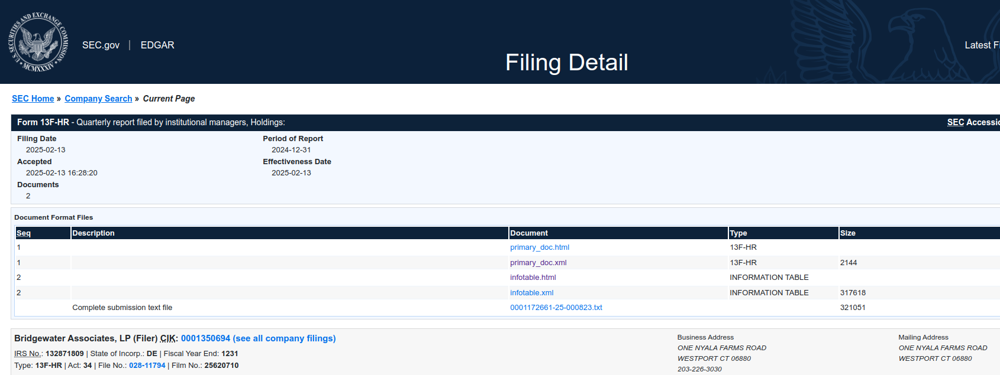
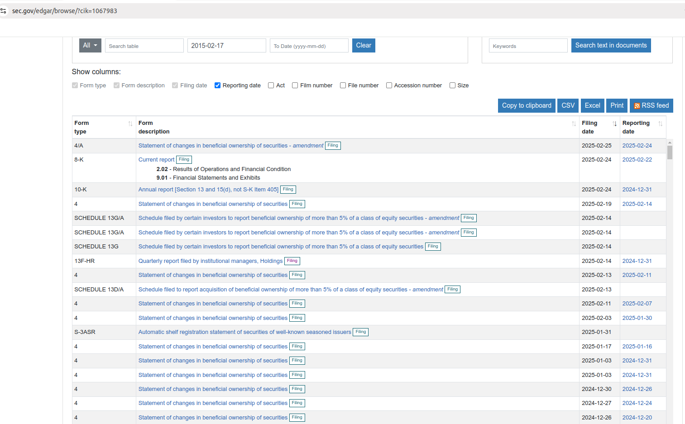
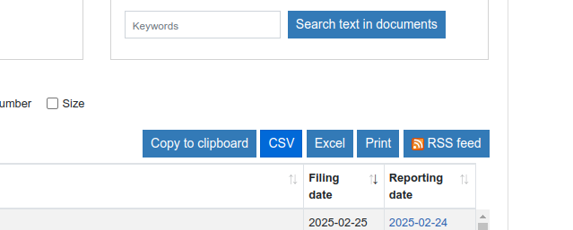
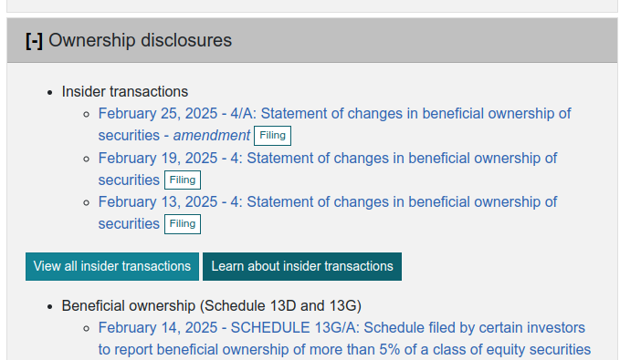

# 13F Analyzer

## How to use Edgar System by SEC

### 13F filings by CIK_KEY

### CIK_KEY

* It is the primary key for a company in EDGAR database system.
* Some company name might return many CIK_KEYs due to children companies.
* Edgar provides forward and invert search based on company names to get CIK_Key(s) or company name based on CIK_KEY.

  - https://www.sec.gov/submit-filings/filer-support-resources/how-do-i-guides/look-central-index-key-cik-number
  - https://www.sec.gov/search-filings/cik-lookup

* The Lookup mechanism is suspected to use following file for the forward and invert search of cik,

- https://www.sec.gov/files/company_tickers.json

>Hint: Study pending, for cases like parent companies and child companies we need to see their holdings and shares to 
make sure that we do not misunderstand how to interpret the shares and total.

## How code works

From the above image, we grab the latest 13F-HR. We need to,

* First grab the URL of the `Filing` button.

`url: https://www.sec.gov/Archives/edgar/data/1350694/000117266125000823/0001172661-25-000823-index.htm`

Then we are in the page of the following `Filing Detail` page,

* Next, we need to parse the xml file called `infotable.html`. and its url looks like the following for example,

* `https://www.sec.gov/Archives/edgar/data/1350694/000117266125000823/xslForm13F_X02/infotable.xml`

## Type of filings

* Form 4: Statement of changes in beneficial ownership of securities
* Form **4A**: Statement of changes in beneficial ownership of securities - amendment
* 8-K: current report **Earning Release**
 - Results of Operations and Financial Condition
 - Financial Statements and Exhibits
* 10-K: annual report for year ending December 31, 2024
* 10-Q: quarterly report
* SCHEDULE 13G: Schedule filed by certain investors to report beneficial ownership of more than 5% of a class of equity securities
* SCHEDULE 13G/A: Schedule filed by certain investors to report beneficial ownership of more than 5% of a class of equity securities - amendment
* Schedule 13D [?]

- https://www.sec.gov/edgar/browse/?cik=1067983
- more about insider trading that is 4 and 4A.

## Hedgefollow Note

We track all hedge fund trades through SEC filings:

* Passive Investments - 13G: Filed when a fund acquires >5% of a company
* Activist Investments - 13D: Filed in similar cases to 13G, but usually the fund has an activist purpose
* Insider Trades - Form 4: Filed when a fund acquires >10% of a company or acts as an insider
* Quarterly Filings - 13F: Filed quarterly, within 45 days of quarter end, for all funds with >$100M

 [csv and RSS]

