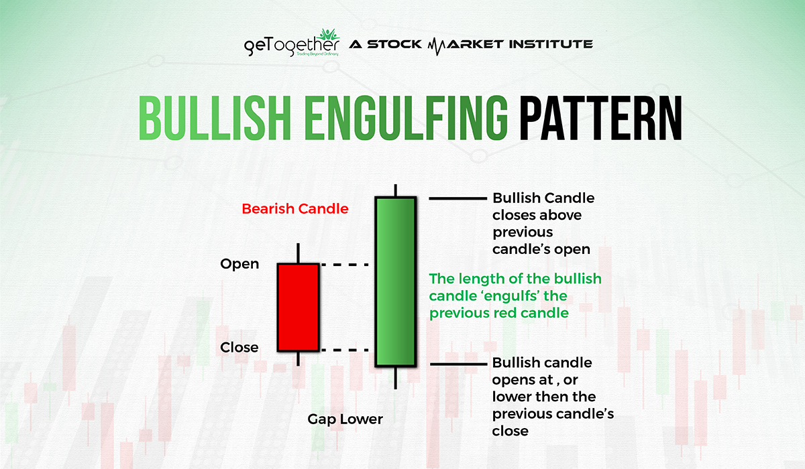
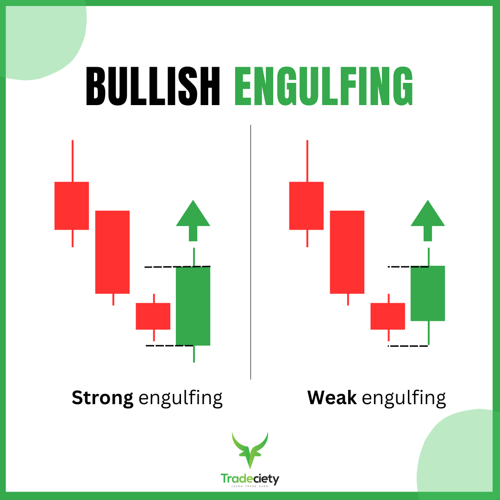
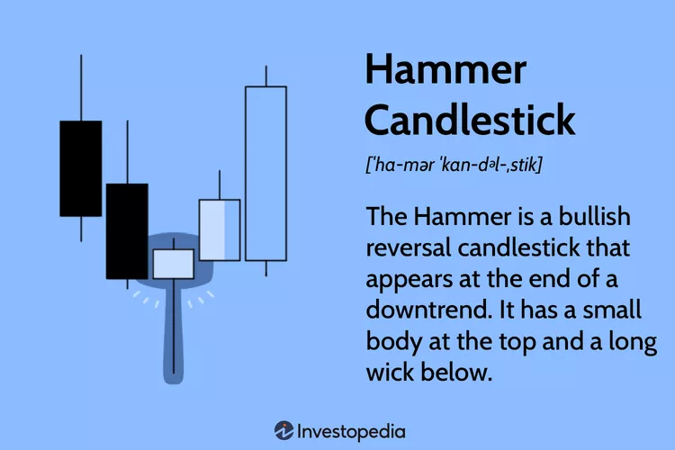
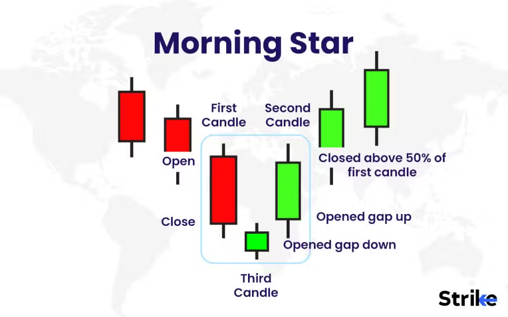
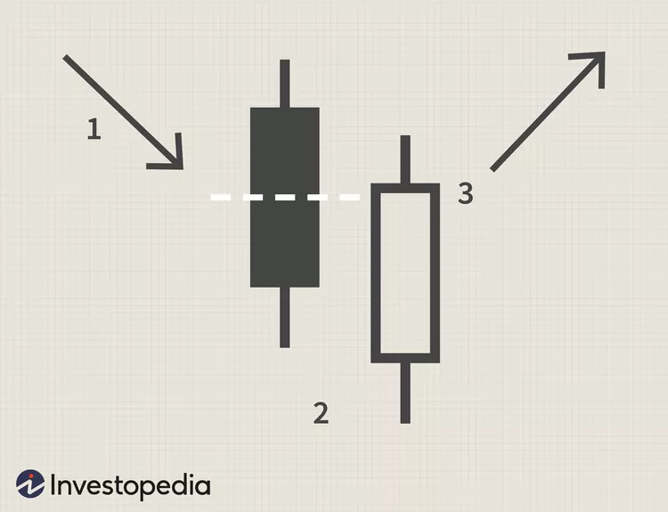
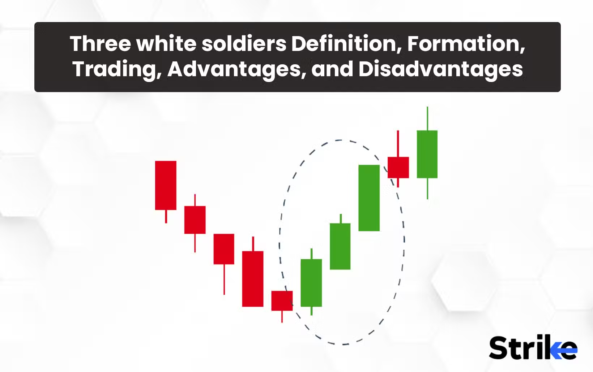
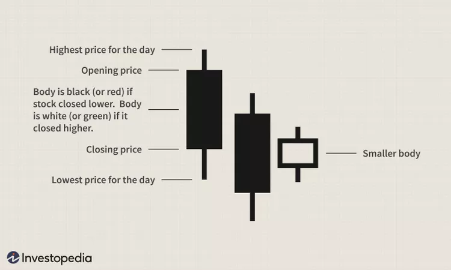

# bull market

In a **bull market**, where prices are generally rising, certain candlestick patterns and symbols are commonly used to identify potential continuation or reversal signals. Here are some key **bullish candlestick patterns** to look for:

---

### **1. Bullish Engulfing Pattern**
   - **Symbol:** A small bearish (red) candle followed by a larger bullish (green) candle that completely "engulfs" the previous candle.
   - **Meaning:** Indicates a potential reversal from a downtrend to an uptrend.

---

### **2. Hammer**
   - **Symbol:** A small body at the top of the candle with a long lower wick (at least twice the length of the body).
   - **Meaning:** Suggests a potential reversal after a downtrend, as buyers step in to push prices higher.

---

### **3. Inverted Hammer**
   - **Symbol:** A small body at the bottom of the candle with a long upper wick.
   - **Meaning:** Indicates potential bullish reversal after a downtrend, as buyers attempt to push prices higher.

---

### **4. Morning Star**
   - **Symbol:** A three-candle pattern: a long bearish candle, a small-bodied candle (doji or spinning top), and a long bullish candle.
   - **Meaning:** Signals a reversal from a downtrend to an uptrend.

---

### **5. Piercing Line**
   - **Symbol:** A bearish candle followed by a bullish candle that closes above the midpoint of the previous candle's body.
   - **Meaning:** Indicates a potential bullish reversal.

---

### **6. Three White Soldiers**
   - **Symbol:** Three consecutive long bullish candles with small wicks.
   - **Meaning:** A strong signal of continued bullish momentum.
   - **Key Takeaways**

Three white soldiers are considered a reliable reversal pattern when confirmed by other technical indicators like the relative strength index (RSI).

The size of the candles and the length of the shadow is used to judge whether there is a risk of retracement.

The opposite pattern of three white soldiers is three black crows, which indicates the reversal of an uptrend.

---

### **7. Bullish Harami**
   - **Symbol:** A large bearish candle followed by a smaller bullish candle completely contained within the body of the previous candle.
   - **Meaning:** Suggests a potential reversal or pause in a downtrend.

The chart above depicts a bullish harami. The first two black candles indicate a two-day downward trend in the asset, and the white candle represents a slightly upward trend on the third day, which is completely contained by the body of the previous candle. Investors seeing this bullish harami may be encouraged by this diagram, as it can signal a reversal in the market.

---

### **8. Rising Three Methods**
   - **Symbol:** A long bullish candle followed by three small bearish candles, all contained within the range of the first candle, and then another long bullish candle.
   - **Meaning:** Indicates a continuation of the bullish trend.

---

### **9. Dragonfly Doji**
   - **Symbol:** A candle with a small body and a long lower wick, with little to no upper wick.
   - **Meaning:** Suggests a potential bullish reversal after a downtrend.

---

### **10. Breakaway Gap**
   - **Symbol:** A gap up in price after a consolidation or downtrend, followed by strong bullish candles.
   - **Meaning:** Indicates the start of a new bullish trend.

---

### **Key Notes:**
- These patterns are most effective when confirmed by other technical indicators (e.g., volume, moving averages, RSI).
- Always consider the broader market context and trends before making trading decisions.

Let me know if you'd like further clarification or examples! 🚀📈