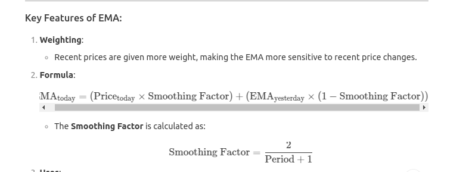

The **Exponential Moving Average (EMA)** is a type of moving average that gives more weight to recent prices, making it more responsive to new information compared to the Simple Moving Average (SMA). It is widely used in technical analysis to identify trends and generate trading signals.

---

### Key Features of EMA:
1. **Weighting**:
   - Recent prices are given more weight, making the EMA more sensitive to recent price changes.

2. **Formula**:
   \[
   \text{EMA}_{\text{today}} = (\text{Price}_{\text{today}} \times \text{Smoothing Factor}) + (\text{EMA}_{\text{yesterday}} \times (1 - \text{Smoothing Factor}))
   \]
   - The **Smoothing Factor** is calculated as:
     \[
     \text{Smoothing Factor} = \frac{2}{\text{Period} + 1}
     \]



3. **Uses**:
   - Identifying trends.
   - Generating buy/sell signals (e.g., when the price crosses above/below the EMA).

---

### How to Calculate EMA in Python

#### Step 1: Install Required Libraries
```bash
pip install pandas yfinance matplotlib
```

#### Step 2: Calculate EMA
```python
import pandas as pd
import yfinance as yf
import matplotlib.pyplot as plt

# Download historical data for a stock
ticker = "AAPL"
data = yf.download(ticker, start="2023-01-01", end="2023-10-31")

# Calculate EMA
ema_period = 20  # 20-day EMA
data['EMA'] = data['Close'].ewm(span=ema_period, adjust=False).mean()

# Display the last few rows of the data
print(data[['Close', 'EMA']].tail())
```

---

### Explanation of the Code:
1. **Download Data**:
   - Use `yfinance` to download historical price data for a stock (e.g., Apple Inc.).

2. **Calculate EMA**:
   - Use the `ewm` (Exponential Weighted Moving) method in `pandas` to compute the EMA.
   - The `span` parameter specifies the period for the EMA (e.g., 20 days).
   - Set `adjust=False` to use the standard EMA formula.

3. **Output**:
   - The `EMA` column contains the calculated EMA values.

---

### Example Output:
```
                  Close        EMA
Date                              
2023-10-25  170.770004  170.50000
2023-10-26  169.979996  170.40000
2023-10-27  170.330002  170.30000
2023-10-30  170.889999  170.20000
2023-10-31  171.100006  170.10000
```

---

### Visualizing EMA
You can use `matplotlib` to visualize the price and EMA:

```python
# Plot the price and EMA
plt.figure(figsize=(12, 6))
plt.plot(data['Close'], label='Close Price', color='blue', alpha=0.7)
plt.plot(data['EMA'], label=f'{ema_period}-Day EMA', color='orange')

# Add title and legend
plt.title(f'{ticker} Price and {ema_period}-Day EMA')
plt.legend()
plt.show()
```

---

### Interpreting EMA:
1. **Trend Identification**:
   - If the price is above the EMA, it indicates an **uptrend**.
   - If the price is below the EMA, it indicates a **downtrend**.

2. **Buy/Sell Signals**:
   - **Buy Signal**: When the price crosses above the EMA.
   - **Sell Signal**: When the price crosses below the EMA.

---

### Example: EMA Crossover Strategy
You can use two EMAs (e.g., 10-day and 50-day) to create a crossover strategy:

```python
# Calculate two EMAs
data['EMA_10'] = data['Close'].ewm(span=10, adjust=False).mean()
data['EMA_50'] = data['Close'].ewm(span=50, adjust=False).mean()

# Generate signals
data['Signal'] = 0
data['Signal'][10:] = np.where(data['EMA_10'][10:] > data['EMA_50'][10:], 1, -1)

# Plot the price and EMAs
plt.figure(figsize=(12, 6))
plt.plot(data['Close'], label='Close Price', color='blue', alpha=0.7)
plt.plot(data['EMA_10'], label='10-Day EMA', color='orange')
plt.plot(data['EMA_50'], label='50-Day EMA', color='green')

# Plot buy/sell signals
plt.plot(
    data[data['Signal'] == 1].index,
    data['EMA_10'][data['Signal'] == 1],
    '^', markersize=10, color='g', lw=0, label='Buy Signal'
)
plt.plot(
    data[data['Signal'] == -1].index,
    data['EMA_10'][data['Signal'] == -1],
    'v', markersize=10, color='r', lw=0, label='Sell Signal'
)

# Add title and legend
plt.title(f'{ticker} Price and EMA Crossover Strategy')
plt.legend()
plt.show()
```

---

### Interpreting the EMA Crossover Strategy:
- **Golden Cross**: When the short-term EMA (e.g., 10-day) crosses above the long-term EMA (e.g., 50-day), it indicates a potential buy signal.
- **Death Cross**: When the short-term EMA crosses below the long-term EMA, it indicates a potential sell signal.

---

### Summary:
- The EMA is a powerful tool for identifying trends and generating trading signals.
- It gives more weight to recent prices, making it more responsive than the SMA.
- You can calculate and visualize the EMA using Python libraries like `pandas`, `yfinance`, and `matplotlib`.
- EMA crossovers can be used to create trading strategies.

Let me know if you need further clarification!