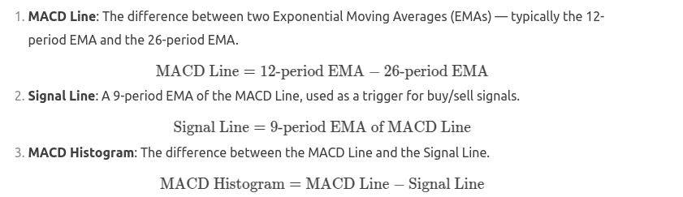

The **MACD (Moving Average Convergence Divergence)** is a popular technical indicator used in financial markets to identify trends, momentum, and potential buy/sell signals. It consists of three components:

1. **MACD Line**: The difference between two Exponential Moving Averages (EMAs) — typically the 12-period EMA and the 26-period EMA.
   \[
   \text{MACD Line} = \text{12-period EMA} - \text{26-period EMA}
   \]

2. **Signal Line**: A 9-period EMA of the MACD Line, used as a trigger for buy/sell signals.
   \[
   \text{Signal Line} = \text{9-period EMA of MACD Line}
   \]

3. **MACD Histogram**: The difference between the MACD Line and the Signal Line.
   \[
   \text{MACD Histogram} = \text{MACD Line} - \text{Signal Line}
   \]



---

### How to Calculate MACD in Python
You can calculate the MACD using the `pandas` and `ta-lib` (Technical Analysis Library) libraries. Below is an example:

#### Step 1: Install Required Libraries
```bash
pip install pandas ta-lib yfinance
```

#### Step 2: Calculate MACD
```python
import pandas as pd
import yfinance as yf
import talib

# Download historical data for a stock
ticker = "AAPL"
data = yf.download(ticker, start="2023-01-01", end="2023-10-31")

# Calculate MACD and Signal Line
data['MACD'], data['Signal'], data['Histogram'] = talib.MACD(
    data['Close'], fastperiod=12, slowperiod=26, signalperiod=9
)

# Display the last few rows of the data
print(data[['Close', 'MACD', 'Signal', 'Histogram']].tail())
```

---

### Explanation of the Code:
1. **Download Data**:
   - Use `yfinance` to download historical price data for a stock (e.g., Apple Inc.).

2. **Calculate MACD**:
   - Use `talib.MACD` to compute the MACD Line, Signal Line, and Histogram.
   - The `fastperiod` is the 12-period EMA, the `slowperiod` is the 26-period EMA, and the `signalperiod` is the 9-period EMA of the MACD Line.

3. **Output**:
   - The `MACD` column contains the MACD Line.
   - The `Signal` column contains the Signal Line.
   - The `Histogram` column contains the MACD Histogram.

---

### Example Output:
```
                  Close      MACD    Signal  Histogram
Date                                                  
2023-10-25  170.770004  0.123456  0.098765   0.024691
2023-10-26  169.979996  0.120000  0.100000   0.020000
2023-10-27  170.330002  0.118000  0.101000   0.017000
2023-10-30  170.889999  0.119500  0.102500   0.017000
2023-10-31  171.100006  0.121000  0.103000   0.018000
```

---

### Interpreting MACD:
1. **MACD Line Crosses Signal Line**:
   - **Bullish Signal**: When the MACD Line crosses above the Signal Line, it indicates a potential buy signal.
   - **Bearish Signal**: When the MACD Line crosses below the Signal Line, it indicates a potential sell signal.

2. **MACD Histogram**:
   - Positive values indicate bullish momentum.
   - Negative values indicate bearish momentum.
   - The histogram's height represents the strength of the momentum.

3. **Zero Line Cross**:
   - When the MACD Line crosses above the zero line, it indicates a bullish trend.
   - When the MACD Line crosses below the zero line, it indicates a bearish trend.

---

### Visualizing MACD
You can use `matplotlib` to visualize the MACD indicator along with the price chart:

```python
import matplotlib.pyplot as plt

# Plot the price and MACD
plt.figure(figsize=(12, 8))

# Price Chart
plt.subplot(2, 1, 1)
plt.plot(data['Close'], label='Close Price', color='blue')
plt.title(f'{ticker} Price and MACD')
plt.legend()

# MACD Chart
plt.subplot(2, 1, 2)
plt.plot(data['MACD'], label='MACD Line', color='orange')
plt.plot(data['Signal'], label='Signal Line', color='red')
plt.bar(data.index, data['Histogram'], label='MACD Histogram', color='gray')
plt.legend()

plt.show()
```

---

### Summary:
- The MACD indicator is a powerful tool for identifying trends and momentum.
- It consists of the MACD Line, Signal Line, and Histogram.
- You can calculate and visualize it using Python libraries like `pandas`, `ta-lib`, and `matplotlib`.
- Use MACD in conjunction with other indicators for better trading decisions.