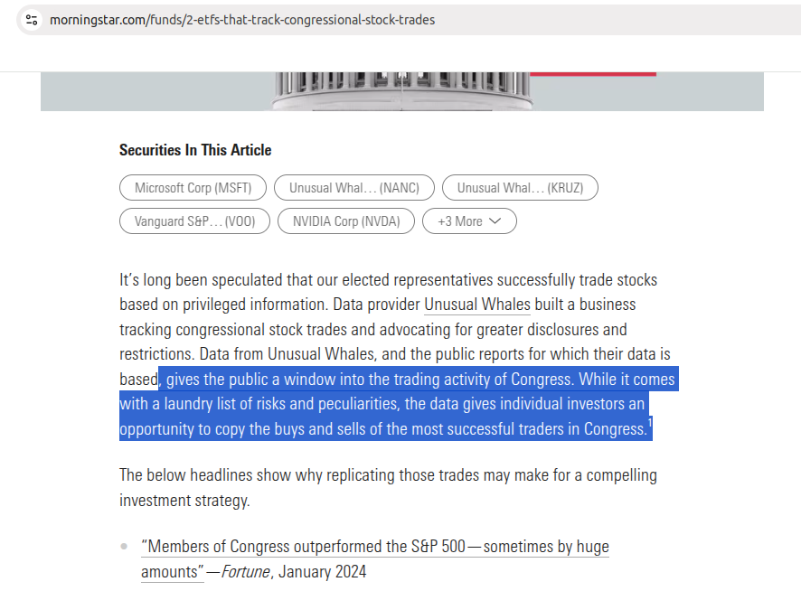
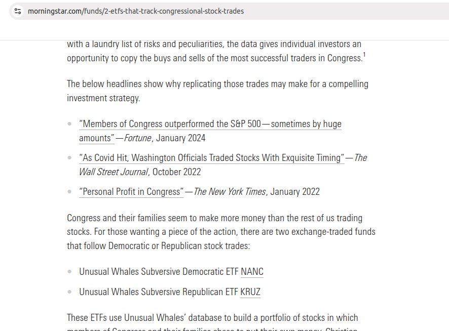
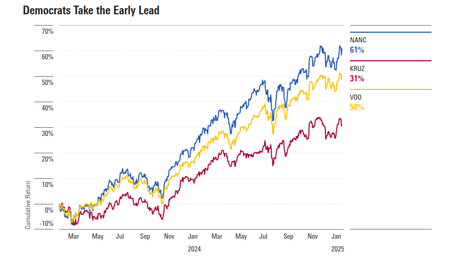
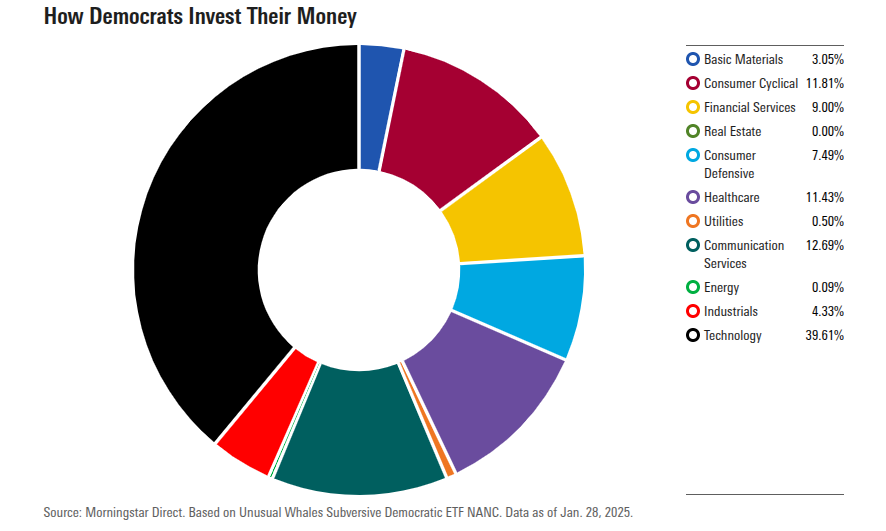
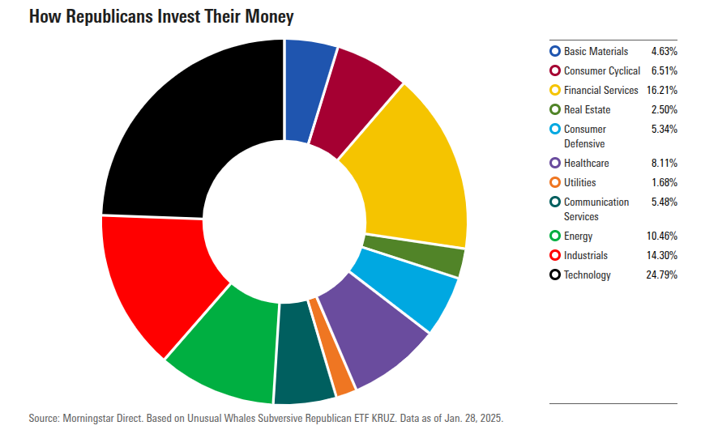
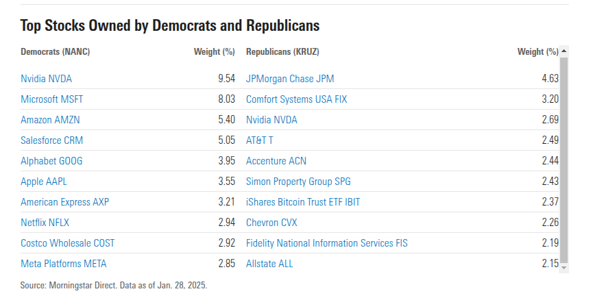

# People

In this doc, we would like to study,

* senator and all the house representative.

* Their holdings and where they report to the gov. Such as database, csv...etc.

* Where they put their money to, some money manager, what are their names?

* A lot of websites have done this too. We would like to know more about this.

## Tracker or ETF

**Two ETF**

* Unusual Whales Subversive Democratic ETF NANC
* Unusual Whales Subversive Republican ETF KRUZ

These ETFs use Unusual Whales’ database to build a portfolio of stocks in which members of Congress and their families chose to put their own money. Christian Cooper, portfolio manager for the ETFs’ sponsor, Subversive, also suggests a “congressional information filter” helps representatives avoid marginal or volatile companies. By this logic, Cooper believes both ETFs should perform better and be less volatile than traditional index ETFs like Vanguard S&P 500 ETF VOO and SPDR Dow Jones Industrial Average ETF DIA.

While the investment merit is questionable, the Unusual Whales Subversive Democratic and Republican ETFs tell interesting stories. Several trends reveal themselves when examining track records, portfolios, and related research.

**What Stocks Does Congress Own?**

Whatever you think of the stock-picking prowess of Congress, or these two ETFs’ ability to capture it, the portfolios represent a useful snapshot into the financial interests of our elected representatives. Each ETF weights its holdings based on total money invested by each party, so they should be a good approximation.

Democrats favor technology and other high-growth stocks, while Republicans also own technology stocks but generally favor energy, industrial, or financial companies. Below is a snapshot of the sector allocations for each portfolio.

**ETF Investing Considerations**

These ETFs are just two pieces of the puzzle when it comes to untangling the web of congressional stock trades and their financial interests. Their portfolios are useful for understanding where members of Congress choose to invest their money, but the jury is out on their long-term investment merit. Here are a few key takeaways for ETF investors considering one or both:

* Members of Congress may or may not outperform the market, depending on whom you ask. In the early innings of these ETFs, Democrats appear to be savvier traders.

* Portfolio changes in these ETFs are not driven by market forces or a rules-based investment process, but rather on the unknowable motives of 535 people in Washington—these motives could be economic or not, or lawful or not.

* If Congress has an edge, it may be impossible to replicate. Data used to construct these portfolios is imperfect. Trading disclosures are self-reported and delayed and lack exact amounts.
Congress is under pressure to ban stock trading by its members. If signed into law, these ETFs could be no longer.

## Ref

- https://disclosures-clerk.house.gov/FinancialDisclosure#:~:text=These%20reports%20are%20filed%20with,5%20U.S.C.
- https://campaignlegal.org/update/how-congress-hides-stock-holdings-plain-sight
- https://www.smartinsider.com/politicians/
- https://trendspider.com/markets/congress-trading/
- https://www.ballardspahr.com/insights/alerts-and-articles/2024/10/politician-trading-if-you-cant-stop-them-join-them
- https://www.congress.gov/bill/112th-congress/senate-bill/2038
- https://www.morningstar.com/funds/2-etfs-that-track-congressional-stock-trades
- https://unusualwhales.com/